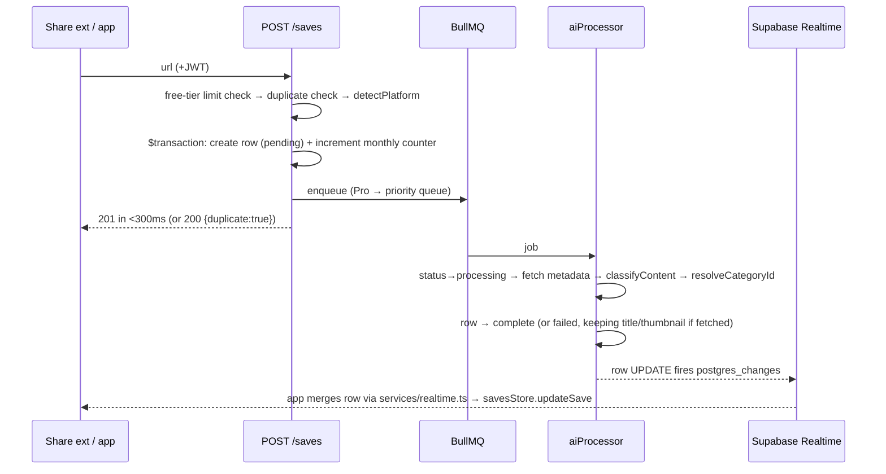

# Oshi — Application Behaviour Reference

> Precise runtime semantics: state machines, flows, and business rules as **implemented**.
> Where this document and the PRD disagree on business logic, the PRD wins and the discrepancy should be flagged;
> where it disagrees with older docs on versions/libraries, the code wins (see `CLAUDE.md`).
>
> **Doc version:** 1.0 · **Created:** 2026-09-18 17:32 UTC · **Last updated:** 2026-09-18 17:32 UTC · **App/Backend:** 1.0.0

---

## 1. System shape

Three layers, one backend deployable:

1. **Phone** — React Native 0.81 / Expo SDK 54. Zustand stores, axios `apiClient` (JWT attach + single silent refresh on 401), Supabase JS client (anon key, session in SecureStore under `oshi_session`).
2. **Backend** — Node 20 / Express 4 on Railway. **API server, BullMQ workers, and node-cron jobs run in one process** (`backend/src/index.ts`); Sentry initialises first; graceful shutdown drains workers.
3. **External** — Supabase (Postgres + Auth + Storage + Realtime), Redis (queues + smart-sort cache), OpenAI GPT-4o-mini, YouTube Data API v3, Expo Push, RevenueCat, PostHog (app only), Sentry.

All endpoints live under `/api/v1` and return **snake_case** JSON; optional fields are **omitted when null** (never `null`), array fields are never `null`. Error envelope, always: `{ "error": { "code", "message", "statusCode" } }`. 5xx report to Sentry; 4xx don't.

## 2. The save lifecycle

Two orthogonal state machines on every save, plus a link-health flag:

**`processing_status`** (AI pipeline): `pending → processing → complete | failed`; `failed → pending` via `POST /saves/:id/retry` (only allowed from `failed`, else 422).

**`status`** (user triage): `unread → done | skipped`, both reversible to `unread`.
- `done` sets `done_at = NOW()` and clears `skipped_at`; also emits engagement signal `done` and deletes the cached thumbnail on-device.
- `skipped` sets `skipped_at` and clears `done_at`; emits signal `skipped`.
- reverting to `unread` clears **both** timestamps.

**`link_status`**: `active | unavailable | private`, maintained by the nightly dead-link checker (02:00 UTC).

**Soft deletes:** `DELETE /saves/:id` sets `deleted_at` (purge after 7 days is promised but the purge cron does not exist yet — see the architecture review backlog). Users: `deleted_at` with a 30-day window. Every query filters `deleted_at IS NULL`; the one exception is `POST /saves/:id/restore` (added 2026-09-18), which clears `deleted_at` for the undo path — status and timestamps are untouched by delete, so the save returns exactly as it was.

### 2.1 Creating a save (critical path)

Rules encoded there:
- **Free tier limit**: 20 saves/calendar month, checked against `items_saved_this_month`, incremented **atomically with row creation** in one `$transaction`. Pro/trial bypass. Limit reached → `SAVE_LIMIT_REACHED` error → app shows paywall.
- **Duplicate URL** (same user, not deleted): returns `200` with the existing save + `duplicate: true` — clients count it as "skipped", never an error.
- **Platform** is detected immediately from the hostname (single module `services/platform.ts`; unparseable → `other`) so the card renders a platform badge before AI finishes; the worker re-detects authoritatively during metadata fetch.
- New saves default to the user's **"Other"** category until AI assigns one.
- **Never AI-process inside a request** — the route only enqueues.

### 2.2 AI classification rules

- Model `gpt-4o-mini`, temperature 0.2, max 200 tokens; 3 attempts with 1s/2s/4s backoff; all-fail → `processing_status='failed'` (metadata that was fetched — title/thumbnail/creator — is still saved).
- System prompt is built **dynamically from the user's actual category names** (defaults only as fallback); "Other" is always present.
- `confidence_score < 0.5` **or** unrecognised category → forced to "Other". Content types outside the fixed set → `other`. Tags capped at 3. Summary capped at 120 chars. Confidence clamped to [0,1].
- Name→id resolution (`resolveCategoryId`) is case-insensitive with "Other"-row fallback; a category deleted mid-processing therefore lands in "Other", or `null` category only if the user somehow lacks "Other".
- The URL itself is **not** sent to OpenAI — metadata only.

### 2.3 Metadata fetch behaviour

YouTube via Data API v3 (full); Instagram/TikTok/Twitter via Open Graph **only** (scraping beyond OG is forbidden — IP-ban risk); LinkedIn/Facebook use browser-like headers + platform fallback thumbnails; generic web = OG + Cheerio first-500-words. 10s timeout, 5MB response cap.

## 3. Library behaviour (the Home screen)

**Fetch-all, filter-client-side** (ADR-0001): `GET /saves?sort=…&limit=500` with **no** category param, stored as `allSaves`. `GET /saves` fires only on: app load, pull-to-refresh, header refresh, after adding a save, and on sort change. Category tabs, search, platform/status chips are pure in-memory filtering — no API calls.

**The derive-once invariant** (ADR-0012): visible `saves` ≡ `applyFilter(allSaves, activeCategoryId, searchQuery, platformFilter, statusFilter)`, enforced by the single `withDerivedSaves` helper. The saves array is **never cleared before a fetch completes** (ADR-0002) — stale cards + spinner beat a blank screen.

**Search** matches title, creator, summary, tags, and URL (client-side, case-insensitive, 300ms debounce). **Platform and status chip filters are independent** — each applies only when its selection is non-empty.

**Sorts**: `ai_recommended` (default) | `recent` | `oldest` | `shortest` (nulls last) | `manual` (nulls fall back to recency). Sort preference persists in AsyncStorage (`oshi_sort_global`).

**Category counts** shown on tabs are computed from `allSaves` in memory; `fetchCategories` refreshes server counts after mutations.

### 3.1 Smart sort (`ai_recommended`)

Computed server-side (`smartSortService`) from engagement signals; cached in Redis per **(user × category)** for 1 hour. **Invalidation contract — any mutation of a save's presence, status, or category invalidates**: POST /saves (new save), PATCH (status or category change → both old and new category caches), DELETE and restore (fixed 2026-09-18 — FIX-20260918-01/-13), and the AI worker after classification moves a save out of "Other" (FIX-20260918-14). Other sorts use Prisma cursor pagination directly.

### 3.2 Mutations are optimistic

Every store mutation: update local state (via `withDerivedSaves`) → call API → **roll back local state if the call fails**. Single-item done/skip/delete also arm a 5s **undo toast**; undo restores the previous status via PATCH (an undone delete is a PATCH resurrecting the soft-deleted row's status). Bulk actions (done/skip/delete/move) fan out `Promise.allSettled` PATCH/DELETE calls and exit multi-select immediately.

## 4. Realtime

`services/realtime.ts` (ADR-0013) owns one app-global channel `saves-updates` subscribed to `postgres_changes` UPDATEs on `saves`. On each row: merge into `savesStore` (which maps `category_id` → nested category object if needed); refresh category counts when `processing_status` hits `complete` or the category changed. Subscribed while HomeScreen is mounted and a user session exists; idempotent resubscribe; torn down on unmount/sign-out. **Realtime over polling, always.**

## 5. Offline queue

`offlineQueue.ts` is the **sole owner** of AsyncStorage key `oshi_offline_queue` (ADR-0009). Enqueue when saving without network. Flush triggers: app-foreground, network-reconnect (NetInfo), and processor start — guarded by an `isProcessing` flag so concurrent triggers can't double-post. Failed items are written back for the next attempt. The iOS share extension writes to App Group key `oshi_pending_share`; `shareExtension.processPendingShares()` drains that into the offline queue and delegates the flush. UI shows "X saves syncing…" via a status listener.

## 6. Auth & security model

- Sign-in via Supabase Auth; JWT stored in **Expo SecureStore only** (never AsyncStorage). App uses the **anon** key; the **service-role** key exists server-side only, where `requireAuth` validates the JWT and sets `req.userId`.
- **Every protected query is scoped by `req.userId`** — cross-user access returns 404, not 403 (no existence leaks).
- apiClient: attaches JWT per request; on 401 performs one silent refresh (queueing concurrent requests), signs out if refresh fails.
- JWT is synced to the iOS App Group (`oshi_shared_session`) for the share extension: on sign-in, session restore, token refresh, foreground; cleared on sign-out.
- Rate limits: global limiter + tighter per-route (e.g. 60/min/user on POST /saves). RevenueCat webhook authenticates via the `REVENUECAT_WEBHOOK_AUTH_HEADER` shared secret.
- RLS is enabled on every Supabase table.

## 7. Navigation gate & deep links

Root gate: `Main` renders only when `session !== null` **AND** `onboardingStore.isComplete` (ADR-0008) — account creation happens at onboarding step 5 of 9, so a session alone isn't enough. Deep-link scheme `oshi://`: `library`, `library/:categorySlug`, `save/:saveId`, `settings/reminders`, `settings/subscription`, `auth/reset?token=…`; `oshi://notifications/enable` is intercepted to open OS notification settings. The middle tab is **Import** (ADR-0006); search lives inline in the Library header.

## 8. Notifications & reminder engine

- Cron (`cron/scheduler.ts`, UTC) runs **every minute**: users whose `reminder_time` HH:MM matches now and whose `reminder_days` includes today get a push — **skipped** if they have zero unread saves or opened the app in the last 2 hours. Notification deep-links to the category with most unread (`oshi://library/:slug`); opens are logged via `POST /notifications/log-open`.
- Monthly cron `0 0 1 * *` resets every user's `items_saved_this_month` to 0.
- Nightly 02:00 UTC dead-link checker updates `link_status`.
- Trial-expiry pushes are scheduled through the delayed `notification-scheduler` queue.

## 9. Monetization rules

| Tier | Saves | Custom categories | Extras |
|------|-------|-------------------|--------|
| Free | 20/month | 3 | basic reminders |
| Trial (7d, auto on signup) | unlimited | unlimited | all Pro |
| Pro | unlimited | unlimited | priority AI queue, morning digest*, per-category reminders* |

*digest & per-category reminders are partially implemented — see context.md §9.

Paywall triggers: save limit, category limit, Pro-feature touch. Payments entirely via RevenueCat (webhook updates `subscription_status`); downgrade **preserves all content**, only blocks new saves/categories beyond free limits. Signup seeds **11 default categories** and starts the trial. Streaks are Duolingo-style hard reset.

## 10. Performance targets (PRD §10)

- `POST /saves` response: **<300ms** (AI is always async).
- AI completion p95: **≤30s** free, **≤5s** Pro (priority queue, higher concurrency; worker rate-limited to 30 jobs/min for OpenAI).
- Share-extension cold start target <1.5s (in progress).
- `limit=500` fetch-all is the accepted trade-off for libraries under ~500 saves (ADR-0001).

## 11. Environment invariants

- `DATABASE_URL` **must** carry `?pgbouncer=true`; migrations use `DIRECT_URL` (PgBouncer blocks advisory locks).
- `User.id` **is** the Supabase Auth UUID.
- Enum-ish columns are plain strings enforced by Supabase CHECK constraints, not Prisma.
- Backend strictness includes `noUncheckedIndexedAccess` + `exactOptionalPropertyTypes` — patterns like `req.params['id'] as string` and conditional spreads are deliberate.

---

| Doc version | Date (UTC) | Change |
|-------------|------------|--------|
| 1.0 | 2026-09-18 17:32 | Initial behaviour reference. |
| 1.1 | 2026-09-18 18:35 | Restore endpoint, uniform invalidation contract, purge-job caveat. |
