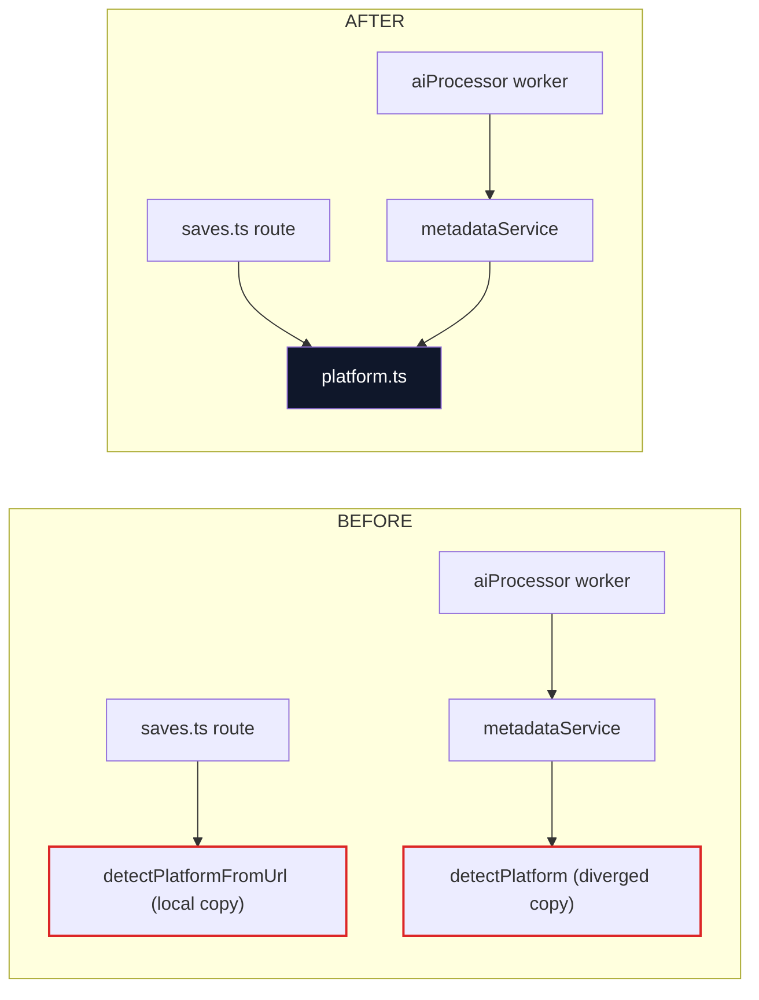
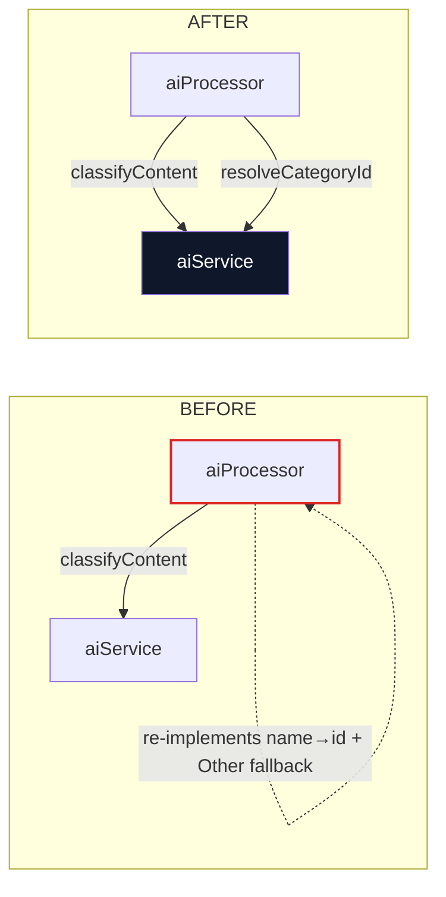

# Architecture Review — 2026-09-18

> Point-in-time review produced with the `improve-codebase-architecture` skill
> (vocabulary: **module, interface, implementation, depth, seam, adapter, leverage, locality** — see `.claude/skills/codebase-design`).
> This file is a snapshot; it is not edited after the fact. Applied changes are logged in [FIXES_LOG.md](FIXES_LOG.md) and recorded as [ADRs](adr/README.md).
>
> **Doc version:** 1.0 · **Created:** 2026-09-18 17:31 UTC · **Reviewed at commit:** `f751e1b` (pre-fix) → fixes applied same day · **Repo:** murtazatiz/Oshi

Legend: **Strong** = clear friction, fix pays back immediately · **Worth exploring** = real but lower-stakes · **Speculative** = revisit only if the area churns.

Because the user asked for the whole review to be *applied*, every candidate below carries an outcome. A prior run of this review (2026-06-09) surfaced the offline-queue candidate, applied as PR #2 → ADR-0009; it is not re-listed.

---

## Candidate 1 — One platform-detection module · **Strong** · in-process · ✅ Applied

**Files:** `backend/src/routes/saves.ts`, `backend/src/services/metadataService.ts`, `backend/src/services/platform.ts` (new)

**Problem.** Two implementations of the same concept. The route kept a private `detectPlatformFromUrl` "to avoid importing the full metadataService bundle" — a void justification, since the API server and workers are one process and metadataService loads at boot regardless. The copies had **already diverged**: the route only recognised `open.spotify.com` while the worker recognised all `spotify.com` hosts, so a save could be created as `web` and later flip to `spotify`. No locality: a new platform meant editing two files, and forgetting one was silent.

**Solution.** New deep-enough module `services/platform.ts`: one small interface (`detectPlatform(url): Platform` + the `Platform` type), pure, total (never throws — unparseable URL → `'other'`). metadataService re-exports it so its interface is unchanged for existing callers.

**Wins:** locality — one file per new platform · divergence structurally impossible · interface shrinks by one private function.

---

## Candidate 2 — aiService owns categorisation end-to-end · **Strong** · in-process · ✅ Applied

**Files:** `backend/src/services/aiService.ts`, `backend/src/workers/aiProcessor.ts`

**Problem.** `parseAiResponse` (private in aiService) guaranteed the returned category *name* is valid, then the worker re-implemented the second half — case-insensitive name→id lookup with an "Other" fallback — inline. The categorisation rule leaked across the seam: half in the service, half in the caller. And the parsing rules (markdown-fence stripping, confidence clamping, forced-"Other" below 0.5) were only exercisable through a live OpenAI call — the interface hid the testable surface.

**Solution.** aiService's interface grew two members that make it deep rather than wide: `resolveCategoryId(name, categories)` (the one place name→id semantics live) and `parseAiResponse` exported (the parsing rules become the test surface). The worker's hand-rolled map + fallback collapsed to one call.

**Wins:** categorisation semantics in one module · parsing rules testable without OpenAI (mock-free) · worker shrinks to orchestration only.

---

## Candidate 3 — Derive-once invariant in savesStore · **Strong** · in-process · ✅ Applied

**Files:** `app/src/store/savesStore.ts`

**Problem.** The store's core invariant — *the visible `saves` list is always `applyFilter(allSaves, …4 filter fields)`* — was maintained by hand at ~20 call sites. Every mutation repeated the same five-argument spread; `markDone`/`markSkipped` were 30-line near-clones of each other. One forgotten spread and the visible list silently drifts from the master list. The deletion test failed loudly: deleting any one copy just moves the complexity to the next copy.

**Solution.** `withDerivedSaves(state, newAllSaves, overrides?)` is now the only path that touches `{ allSaves, saves }` (`applyFilter` has exactly one remaining call site — inside it). `markDone`/`markSkipped` share one private `mutateStatus` implementation (optimistic set + undo → PATCH + engagement signal → rollback). Bonus fix: `fetchSaves` now derives with **post-await** filters, closing a window where a category switch during a slow request rendered with stale filters.

**Wins:** invariant enforced structurally, not by discipline · leverage — one helper, 20 call sites · ~120 lines deleted · store file reads as intent, not mechanics.

---

## Candidate 4 — Realtime subscription owned by a service module · **Strong** · local-substitutable · ✅ Applied

**Files:** `app/src/services/realtime.ts` (new), `app/src/screens/HomeScreen.tsx`

**Problem.** API contract §8 places live updates at a service seam, but the Supabase `postgres_changes` channel lived inside HomeScreen: a `channelRef`, manual channel teardown, and row-merging logic in a screen component. The subscription is app-global (channel name `saves-updates`), yet its lifetime was tied to one screen's render internals — no locality for anyone debugging realtime.

**Solution.** `services/realtime.ts` owns the channel as a module singleton behind a two-function interface (`subscribeToSaveUpdates` / `unsubscribeFromSaveUpdates`), routing rows into `savesStore`. HomeScreen's effect is now three lines. Same pattern offlineQueue already established for module-owned side effects.

**Wins:** realtime logic in one module · screen loses 40 lines of infrastructure · future auth-scoped resubscribe has one home.

---

## Candidate 5 — GET /saves search clause & PATCH double-fetch · **Worth exploring** · in-process · ✅ Applied

**Files:** `backend/src/routes/saves.ts`

**Problem.** The 4-field search OR-clause was pasted twice inside one handler (base query + ai_recommended re-filter) — a copy-edit hazard, not an abstraction problem. PATCH ran two pre-update queries where one suffices (ownership check, then a second fetch of the same row's `categoryId`).

**Solution.** `buildSearchWhere(search)` used by both paths; PATCH's ownership check now selects `categoryId` too.

**Wins:** search fields change in one place · one fewer round-trip per PATCH.

---

## Candidate 6 — Missing smart-sort invalidation on DELETE (bug) · **Strong** · in-process · ✅ Applied

**Files:** `backend/src/routes/saves.ts`, `backend/src/services/smartSortService.ts`

**Problem.** POST and PATCH invalidate the per-(user × category) smart-sort cache; DELETE didn't. A deleted save stayed in the cached ranking for up to 1h — it is filtered out at fetch time (so it doesn't render), but pages shrink, `total_count` and ranking positions go stale, and the three mutation paths disagreed about the cache contract.

**Solution.** DELETE now invalidates like its siblings, using the deleted save's `categoryId`. The cache contract is uniform: *any mutation of a save's presence, status, or category invalidates.* Test case TC-SORT-04 covers it.

---

## Candidate 7 — App type-gate failures · **Strong** · in-process · ✅ Applied

**Files:** `app/src/navigation/types.ts`, `AppNavigator.tsx`, `thumbnailCache.ts`, `ImportScreen.tsx`, `SaveUrlScreen.tsx`

**Problem.** The project's only quality gate (`tsc --noEmit`) failed in the app with ~30 errors, which means the gate was dead: new type errors could land unnoticed. Four root causes: param lists declared as `interface` (React Navigation v7's `ParamListBase` needs the implicit index signature only type aliases get), an SDK-54 `getInfoAsync` options change, a misspelled `copyToCacheDirectory` option, and two theme tokens that don't exist (`typography.h3`, `borderRadius.full ?? 999` — the `?? 999` shows the author knew).

**Solution.** All fixed; **both packages now pass `tsc --noEmit` with zero errors**, making the gate meaningful again. Recorded as ADR-0014 so nobody "cleans up" the type aliases back into interfaces.

---

## Addendum (same day, 17:45 UTC) — deep exploration pass

A sub-agent walk of both packages surfaced a second wave beyond the original survey. All verified against the code before fixing; details per fix in [FIXES_LOG.md](FIXES_LOG.md) FIX-20260918-11…20.

| # | Finding | Strength | Outcome |
|---|---------|----------|---------|
| 8 | Password-reset flow dead: 3-way endpoint mismatch between contract, app, and backend | Strong (bug) | ✅ Backend renamed to contract shape (`reset-password` = email step, `update-password` = token step); contract gap documented |
| 9 | `facebook` missing from the app's platform union + both PLATFORM_META copies → render crash; platform metadata triplicated | Strong (bug) | ✅ One `constants/platforms.ts` module, total `getPlatformMeta()` (ADR-0016) |
| 10 | Undo-after-delete could never restore (PATCH filters deleted rows; no restore path existed) | Strong (bug) | ✅ `POST /saves/:id/restore` + store rewire |
| 11 | Worker leg of the smart-sort invalidation contract missing (classification moves category, cache stays) | Strong (bug) | ✅ Worker invalidates old+new category |
| 12 | Seeded default categories contradicted the PRD; two hardcoded lists | Strong (bug) | ✅ Shared `constants/defaultCategories.ts` |
| 13 | Reminder deep-link slug parsed but read by nothing; `CategoryData.slug` never emitted | Strong (bug) | ✅ Backend emits slug; HomeScreen selects the tab |
| 14 | Two parallel session sources of truth (AppNavigator's private hook vs authStore) | Strong | ✅ RootNavigator reads authStore (ADR-0017) |
| 15 | Copy-paste clusters: 6 RevenueCat handlers, reminder top-category block ×2, LinkedIn/Facebook fetchers, URL validation ×3 | Worth exploring | ✅ All collapsed to single owners |
| 16 | Dead weight: never-rendered banner state, 4 zero-import deps, dead re-export, 7 unreferenced assets, signin error-code drift, formatCategory dead ternary + hardcoded PATCH counts | Worth exploring | ✅ Removed / corrected |

## Backlog — real gaps found but **not** fixed here (feature-sized or needs visual verification)

| Gap | Why it matters | Why deferred |
|-----|----------------|--------------|
| **Paywall unreachable** — `PaywallScreen` is registered but has zero `navigate('Paywall')` call sites; no handler for `SAVE_LIMIT_REACHED`/`CATEGORY_LIMIT_REACHED` errors; Subscription & Reminders settings screens are TODO stubs while trial pushes deep-link to them | The J9 monetization journey doesn't function — PRD §8.3 triggers are unwired | New UI + error-handling flow across several screens; needs product eyes and a running app to verify |
| **Fonts declared, never loaded** — theme names Sora/Inter families but no font files are bundled and nothing calls `useFonts`; every screen silently uses system fonts | Design system §7 typography is aspirational | Needs the actual .ttf assets; re-add `expo-font` with them |
| **Four copy-pasted category-picker bottom sheets** (HomeScreen, ContentDetail, ShareHandler, share-extension — two also re-fetch categories into local state) | The B1-style dedupe of this review, but UI-shaped | Touches 4 rendered surfaces incl. the light-mode-only share extension; needs visual verification |
| **No purge job** — comments and docs promise 7-day/30-day purges of soft-deleted rows; no cron exists; `backend/prisma` has no `migrations/` dir so `prisma:migrate` is a no-op | Deleted data accumulates indefinitely (also a privacy expectation) | Hard-deletes with FK cascades need DB-level testing |
| **Analytics largely unwired** — ~25 of ~55 analytics helpers have zero call sites | The analytics plan (.docx) isn't being measured | Wiring events is product-priority work, pruning them is trivial — decide which |
| **SettingsScreen keeps a parallel categories state** via direct apiClient calls — renames there don't refresh Library tabs until the next fetch | Same stale-tab class of bug the Library refactors killed | Moderate UI refactor to savesStore; verify visually |
| **Navigation chrome ignores dark mode** — AppNavigator styles from the static `theme` object rather than `useTheme` | Dark-mode users get light nav chrome | Whole-navigator theming pass; needs visual verification |
| Port/adapter seam around `apiClient`; app/backend enum codegen; bulk PATCH endpoints | (from the original survey) | Unchanged — see ADR-0015 / contract owner |

## Top recommendation

Applied in full across both waves. Of the set, **Candidate 3 (derive-once savesStore)** was the highest-leverage structural change, and **Addendum #8 (password-reset flow)** the most user-critical bug. The top *remaining* item is the **paywall wiring** row of the backlog — it is the only place a PRD-critical journey (J9) is still unreachable.

---

| Doc version | Date (UTC) | Change |
|-------------|------------|--------|
| 1.0 | 2026-09-18 17:31 | Review produced; candidates 1–7 applied same day. |
| 1.1 | 2026-09-18 18:25 | Addendum: deep exploration pass (8–16 applied) + backlog of feature-sized gaps. |
