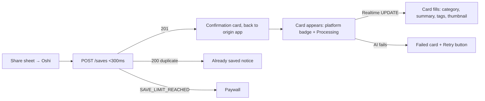

# Oshi — User Journeys

> Every end-to-end journey a user can take, as implemented. Each journey lists its trigger, path, outcome,
> and the regression cases in [TEST_CASES.md](TEST_CASES.md) that cover it.
>
> **Doc version:** 1.0 · **Created:** 2026-09-18 17:33 UTC · **Last updated:** 2026-09-18 17:33 UTC

---

## J1 — First run: install → onboarding → first save

**Trigger:** fresh install. **Covers:** TC-AUTH-01/02, TC-NAV-01.

1. App opens to the 9-step onboarding (no session). Steps walk value prop → permissions → account creation (**step 5**: signup seeds 11 default categories + 7-day Pro trial) → preferences (reminder time) → finish.
2. `RootNavigator` shows Main only when session **and** onboarding-complete are both true — quitting after step 5 resumes onboarding, not the Library.
3. Empty-state Library nudges the user to share their first link or use Import / the Save URL modal.

**Outcome:** authenticated user, trial active, 11 category tabs, reminder time set.

## J2 — Daily core loop: share from another app

**Trigger:** user is scrolling Instagram/YouTube/Safari and hits Share → Oshi. **Covers:** TC-SAVE-01…07, TC-AI-01/02/05.

**Outcome:** the save is in the Library, categorised without the user doing anything. Free users see the limit counter tick toward 20/month.

## J3 — Saving while offline

**Trigger:** J2 or manual save with no connectivity. **Covers:** TC-OFF-01…04.

1. URL is enqueued to the offline queue (`oshi_offline_queue`); iOS share-extension saves go to the App Group queue.
2. Banner shows "X saves queued". On app-foreground or network-reconnect the single flush (guarded, no double-post) drains App Group → offline queue → `POST /saves` each; failures are re-queued.

**Outcome:** nothing is lost; each queued URL becomes a normal J2 save when back online.

## J4 — Morning reminder → revisit

**Trigger:** daily push at the user's `reminder_time`. **Covers:** TC-NOTIF-01…04.

1. Cron matches HH:MM + weekday; skips if zero unread or app opened <2h ago.
2. Notification names the category with most unread; tapping deep-links `oshi://library/:categorySlug` straight to that tab; the open is logged.

**Outcome:** user lands exactly on the pile they meant to get back to.

## J5 — Triaging the Library

**Trigger:** user browsing. **Covers:** TC-LIB-01…08, TC-ACT-01…07.

- Switch category tabs (instant, client-side) · search (title/creator/summary/tags/URL) · platform + status chips (independent) · sort picker (5 modes) · grid/list toggle.
- List view swipes: right = Done, left = Delete. Card kebab: done/skip/edit-category/note/delete. Every action is optimistic with a 5s **Undo** toast; failed API calls roll the card back.
- Open a card → ContentDetail modal → "Open" launches the source app/URL, records an `opened` engagement signal (feeds smart sort), sets `viewed_at`.

**Outcome:** library state matches the server; undo makes triage forgiving.

## J6 — Bulk cleanup

**Trigger:** long-press a card. **Covers:** TC-ACT-05…07.

Multi-select mode → tap to add/remove, "select all in category" → bulk Done / Skip / Delete / Move-to-category → fan-out API calls, counts refresh, multi-select exits.

## J7 — Import an existing hoard

**Trigger:** Import tab (middle tab). **Covers:** TC-IMP-01…03.

- **Paste URLs:** multiline paste → live URL detection → sequential `POST /saves` with progress; duplicates counted as skipped.
- **Browser bookmarks:** pick an exported bookmarks `.html` → parsed `<a href>` list with checkboxes → batch import.

**Outcome:** bulk seeding of the library; every imported URL goes through the same AI pipeline.

## J8 — Managing categories

**Trigger:** category header / edit-category action. **Covers:** TC-CAT-01…04.

Create (free tier: max 3 custom → paywall), rename, re-emoji, delete (**saves move to "Other"**, never lost). AI immediately starts using renamed/created categories (dynamic prompt).

## J9 — Hitting a limit → upgrading

**Trigger:** 21st save in a month, 4th custom category, or a Pro-feature touch. **Covers:** TC-SUB-01…04.

1. Backend rejects with the typed error → app opens Paywall (RevenueCat purchase sheet).
2. Purchase → RevenueCat webhook flips `subscription_status` → limits vanish, AI jobs route to the priority queue.

**Outcome:** friction exactly at the value moment; content never held hostage — **downgrade preserves everything**, only blocks new saves/categories beyond free limits.

## J10 — Failed AI processing → retry

**Trigger:** card shows the Failed state. **Covers:** TC-AI-02.

Tap Retry → `POST /saves/:id/retry` (only valid from `failed`) → card returns to Processing via Realtime → completes or fails again.

## J11 — Streaks & celebration

**Trigger:** daily activity. **Covers:** TC-ENG-02.

Streak counter increments on qualifying daily activity, hard-resets on a missed day (Duolingo-style); milestone overlay celebrates thresholds.

## J12 — Account lifecycle

**Trigger:** Settings. **Covers:** TC-AUTH-03…06.

- Profile edit + avatar upload (Supabase Storage signed URL).
- Sign out (clears SecureStore session + App Group JWT).
- Forgot password → email → `oshi://auth/reset?token=…` deep link → new password.
- Delete account → soft delete (30-day window) → signed out.

## J13 — Returning user, app cold start

**Trigger:** app open with a stored session. **Covers:** TC-AUTH-05, TC-LIB-01.

Session restored from SecureStore → JWT synced to App Group → RevenueCat/PostHog/Sentry user context wired → Library fetch-all → realtime subscribed → pending share queues drained (J3 tail).

---

### Journey ↔ feature matrix

| Journey | Depends on |
|---------|------------|
| J1 | Auth, onboarding gate, category seeding, trial |
| J2 | Share extension, saves API, AI pipeline, realtime |
| J3 | Offline queue (single-owner), share-extension App Group |
| J4 | Cron reminder engine, push, deep links |
| J5 | savesStore derive-once filtering, optimistic mutations, undo, engagement signals |
| J6 | Multi-select, bulk endpoints fan-out |
| J7 | Import screen, duplicate detection |
| J8 | Categories API, dynamic AI prompt |
| J9 | Limits, paywall, RevenueCat webhook, priority queue |
| J10 | Retry endpoint, realtime |
| J11 | Streak rules, milestone overlay |
| J12 | Supabase auth flows, SecureStore, storage |
| J13 | Session restore, realtime, queue drain |

---

| Doc version | Date (UTC) | Change |
|-------------|------------|--------|
| 1.0 | 2026-09-18 17:33 | Initial journey catalogue (J1–J13). |
